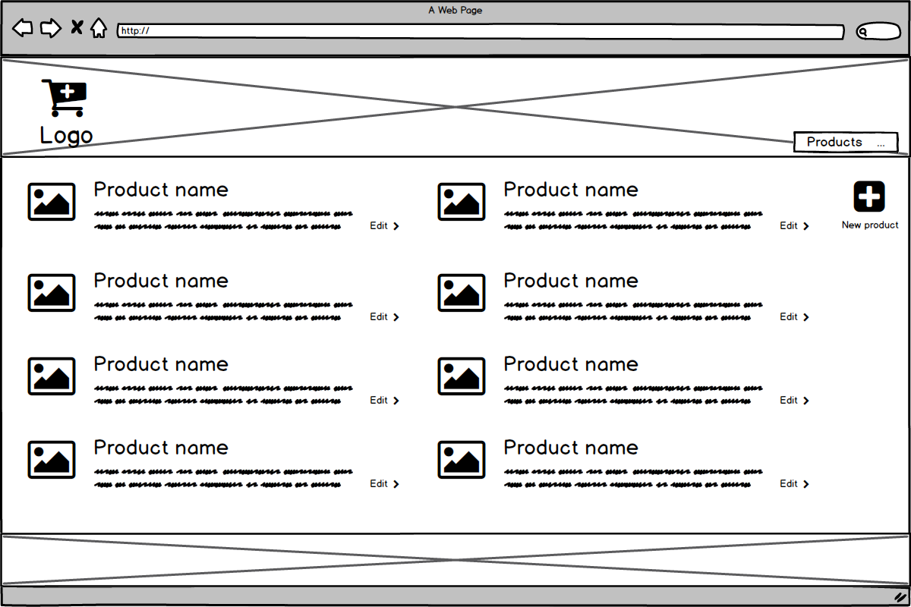
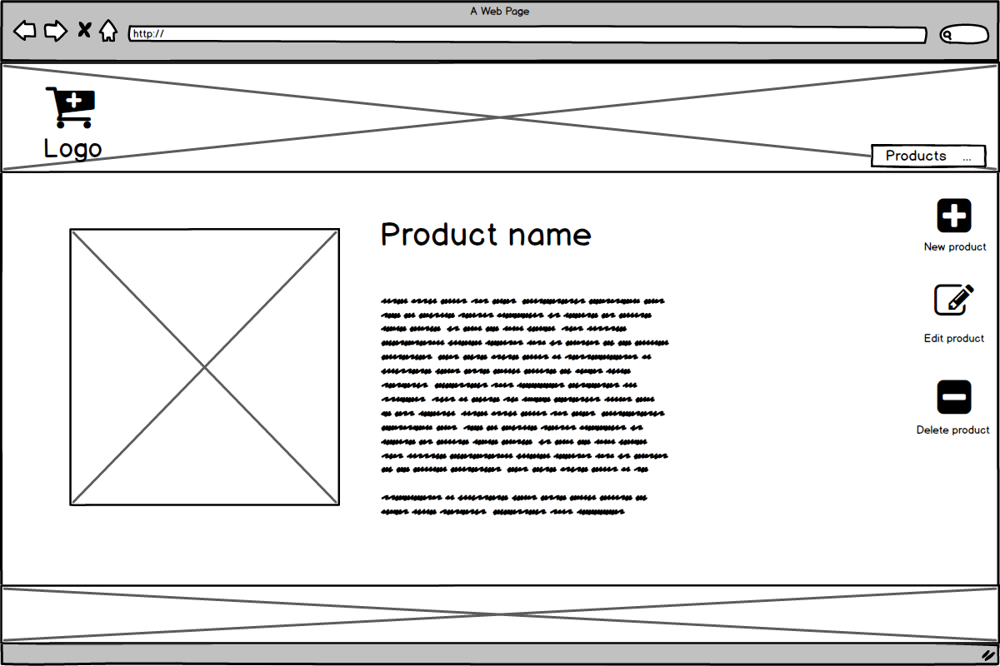
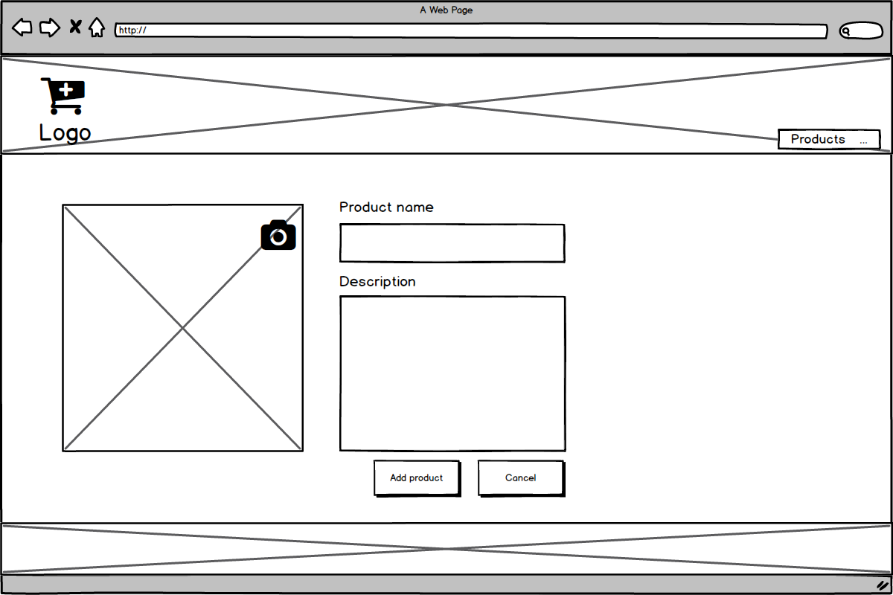
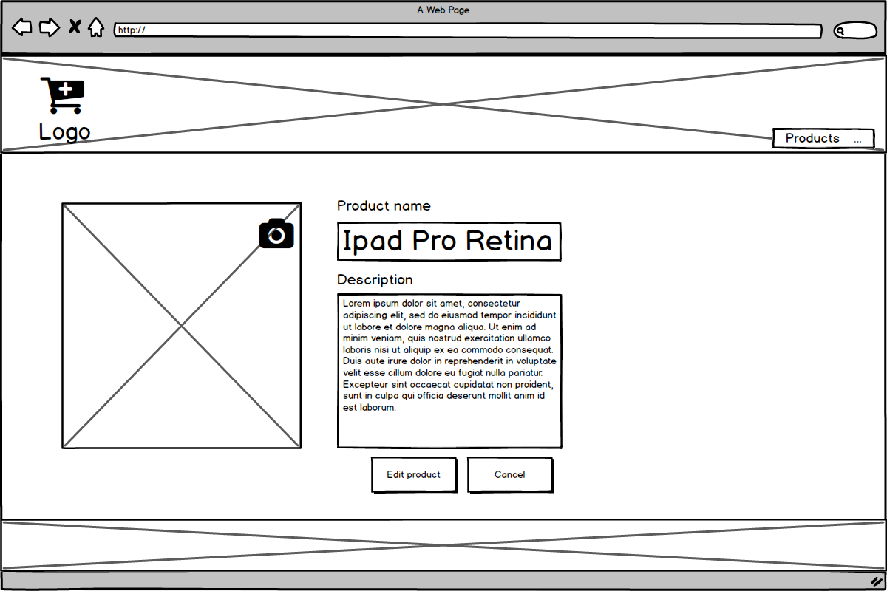
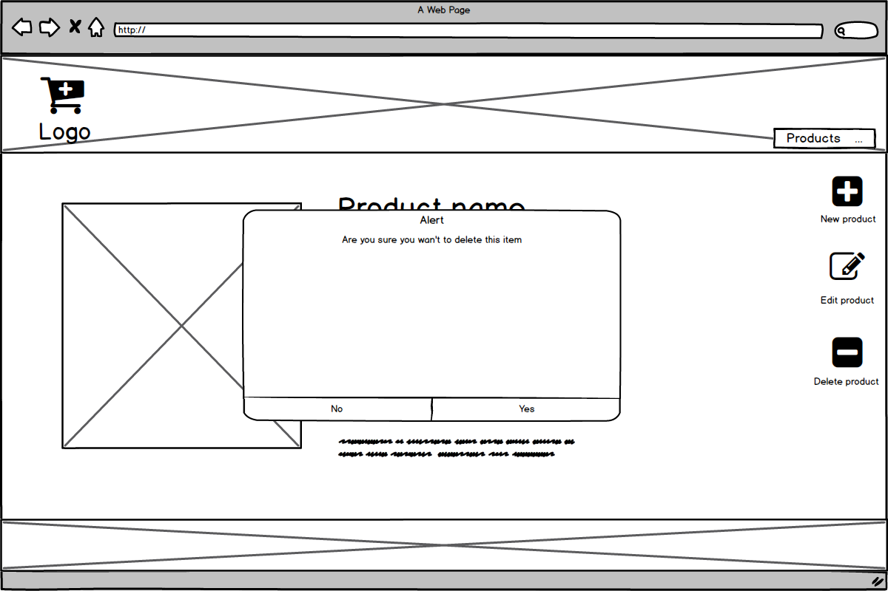

# App Name here

## User Stories

- As an owner, I want to be able to view all my products.
- As an owner, I want to be able to add new products, so that I can have a database of them.
- As an owner, I want to be to add photos for each of my products.
- As an owner, I want to be able to update the descriptions and photos of products.
- As an owner, I want to be able to delete products from the catalog.

###New requirements
  - As a owner, I want to be able to validate mandatory name, description and price when i add a product
  - As a owner, i want to validate price is a floating number
  - As a owner, I want to be able to see a product picture
  - As a owner, I want to have test for my product.

## Wireframe Mockups

Index Page:

Single Item:

Add Product Page:

Edit Product Page:

Delete Product Page:

## Schema screenshot

-

## Installation Notes

Important down the road for listing development dependencies.

## Deployment details and link

- [App Name Link](https:yourthing.herokuapp.com)
